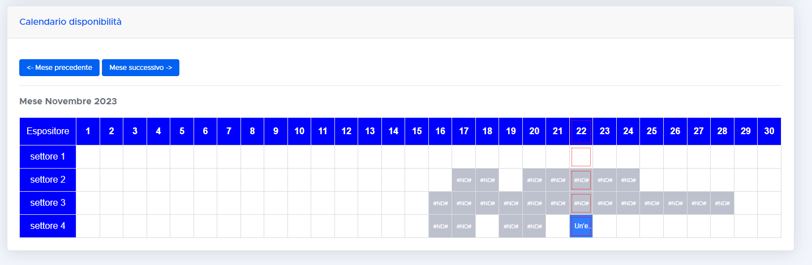

# gantt
** WORK IN PROGRESS... **

# Booking Calendar

In this code, I have created a CRM for booking purposes. It consists of an interactive, public calendar reporting the *sectors* available for booking and the *days numbers* of the current month. 

In a nutshell, the client can select a single timeslot or timerange and send a booking proposal to the slot owner. If accepted, a payment process starts, and once the bank confirms the payment, the calendar is reserved for the client.
A series of emails and notifications are sent to the calendar owner and the client to handle the process. A short demo of the final result is available A short demo of the final result is available here: https://www.youtube.com/watch?v=IaY0i23od4o

## Technologies

The calendar has been created starting from a simple Bootstrap 4 table. The table becomes interactive (modals open on click, cells highlighted on mouseover, rows added, etc.) thanks to JavaScript (and partly PHP). The table is manipulated via AJAX, and all booking information is stored in a MySQL database. The database involves two SQL tables: one for *proposals* and one for *bookings* (a proposal is transformed into a booking once the payment is confirmed). Email are sent via *phpmailer*.

## Validations and Software Structure

There are several validation steps to ensure consistent booking and avoid overlaps.
I mentiond just few of them.

### Calendar Availability

a. Whatever is the range selected, the calendar owner can set the status of a spot as 'not available' only if no bookings are set for the selected period. Same for the 'available' case. 

b. The client can only send proposal and book available slots. 

### Consistent recipient

The proposal are sent by the client to the calendar owner. If the owner tries to send a request to him/herself the system drops an error. 

### Payment Process

a. When the payment process starts, (i.e., the Stripe bank redirects you to complete the 3D secure payment or simply when the payment is processed by the bank) the spots are temporarily frozen to avoid overlaps during the payment process itself. This is because in principle there might be competing bookings going on.

b. Once the payment is finalized and the bank sends a positive feedback, the slot is updated and locked (reserved). If the payment is not successful, the slot is unlocked.

### Further validations

a. The proposal cannot be sent if the forms are not filled-in properly (client side, accomplished via JavaScript);

b. Payments must be finalized the day before within midnight max, otherwise the proposal expires;  

c. If the client clicks again on the payment link received and try to pay the slot again the system drops an error and terminates the payment.

Other validations occurs...

## Further notes on the code

The script `calendar_update.php` contains a more detailed description explaining how the code handles the updating of the calendar.

